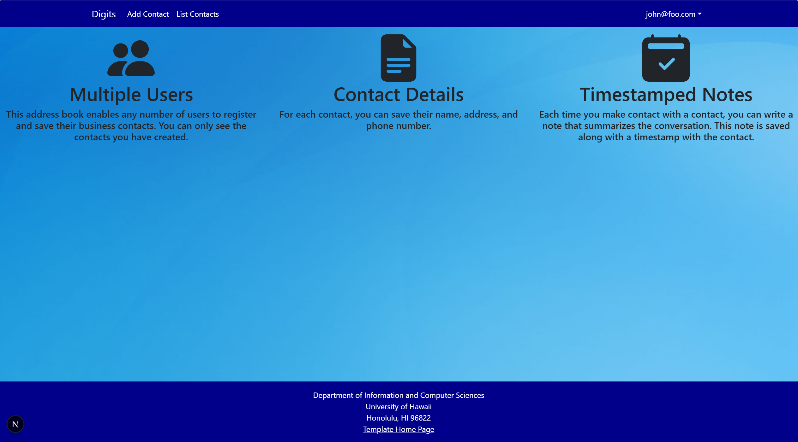

# My Digits Application

## Screenshot

## Installation Instructions

To run this application locally, first clone the repository to your machine and navigate into the project directory. Next, install all required dependencies using npm install.

Before starting the application, ensure that PostgreSQL is installed and running on your system. Create a new database for the project, then apply the database schema by running Prisma migrations. After the database is set up, seed it with initial data using the Prisma seed command.

Once everything is configured, start the development server using npm run dev. The application will then be available in your browser at http://localhost:3000.

# Walkthrough

## Landing Page

When you first open the application, it will bring up the landing page which describes what the page is capable of.

## Register

This page is where you sign in or sign up to create an account with an email and a password.

## User Home Page

Contains the same things as the landing page except as the Add Contacts and List Contacts in the navbar.

## Add Contacts

The add contacts page is where the user can add a contact by inputting their name, email, etc.

## List Contacts

The list contacts page is where the user can inspect the current contacts that are in the database and the user can add notes

## Admin 

If the user is an admin, they have access to a special navbar link that contains all contacts that are associated with all users.
